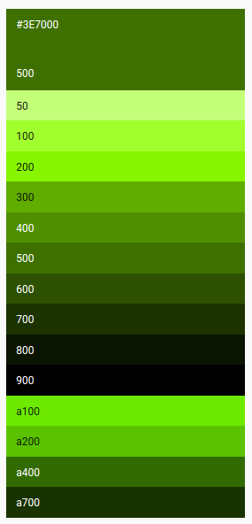

# materialpalette({ h, s, l }) [][ci] [][npm] [][coveralls]

> **Generates material palettes for your colors**

Given an input color it calculates its palette approaching the logic of **[Google Material Design Color Palettes][mdpalettes]**.

**Since the algorithm behind their generation is not (yet) known this module approximates the colors values**.

It works everywhere: browsers, node, and so on.

## Install

With **[npm][npm]** do:

```
npm install material-palette
```

## API

This module exports a single function, the material palette generator.

### `materialpalette({ h: number, s: number, l: number })`

- It takes an object containing the h, s, and l fields

    - The field **h** must be a numeric into **[0, 360]**.

    - The fields **s** and **l** must be numerics into **[0, 100]**.

- It returns an object containing all the 14 palette variants (e.g., 50, 100, 200, ..., A700)

As always, more details **reading the [tests](test.js)** ...

## Example

Suppose you want to generate a material palette for **hsl(87, 100%, 22%)** color (i.e. **#3E7000**).

First of all import the generator.

```javascript
var materialpalette = require('materialpalette') // node
import materialpalette from 'materialpalette' // ES2015
window.materialpalette // browsers
```

Then use it.

```javascript
var ciao = materialpalette({ h: 87, s: 100, l: 22 })
```

Which results in the following object ...

```javascript
{
  '50': { h: 87, s: 100, l: 74 },
  '100': { h: 87, s: 100, l: 59 },
  '200': { h: 87, s: 100, l: 48 },
  '300': { h: 87, s: 100, l: 34 },
  '400': { h: 87, s: 100, l: 28 },
  '500': { h: 87, s: 100, l: 22 },
  '600': { h: 87, s: 100, l: 16 },
  '700': { h: 87, s: 100, l: 10 },
  '800': { h: 87, s: 100, l: 4 },
  '900': { h: 87, s: 100, l: 0 },
  'A100': { h: 92, s: 100, l: 46 },
  'A200': { h: 92, s: 100, l: 38 },
  'A400': { h: 92, s: 100, l: 21 },
  'A700': { h: 92, s: 100, l: 10 }
}
```



## License

MIT © Leonardo Di Donato

---

[](https://github.com/igrigorik/ga-beacon)

[npm]:        https://npmjs.org/package/material-palette
[ci]:         https://travis-ci.org/leodido/material-palette
[coveralls]:  https://coveralls.io/r/leodido/material-palette?branch=master
[mdpalettes]: https://www.google.com/design/spec/style/color.html#color-color-palette
